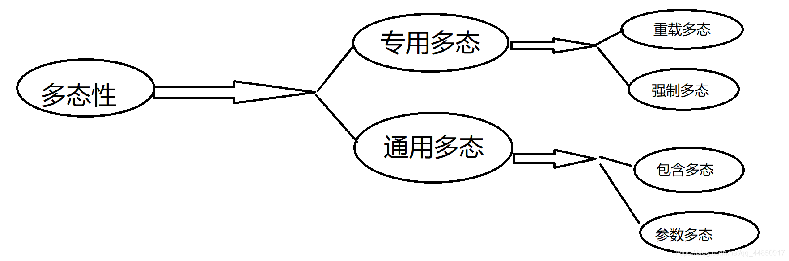
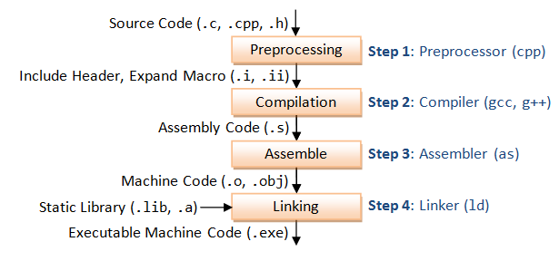
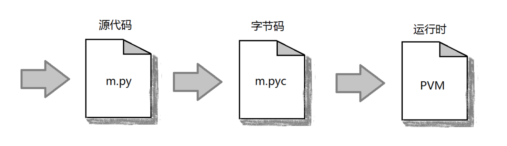
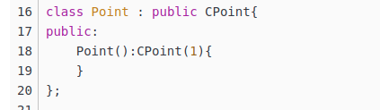
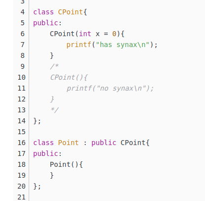

<!--
 * @Date: 2020-08-16 14:54:00
 * @Author: Zhiqi Feng
 * @LastEditors: feng 
 * @LastEditTime: 2020-09-11 14:10:58
 * @FilePath: /job/C++.md
 * @LastEditors: Zhiqi Feng
 * @LastEditTime: 2020-09-01 02:36:14
 * @FilePath: /总结/C++.md
-->
<!-- TOC -->

- [一. C++ 特性](#%E4%B8%80-c-%E7%89%B9%E6%80%A7)
    - [C++ 类的static静态成员](#c-%E7%B1%BB%E7%9A%84static%E9%9D%99%E6%80%81%E6%88%90%E5%91%98)
    - [C++中构造函数，拷贝构造函数和赋值函数的区别和实现](#c%E4%B8%AD%E6%9E%84%E9%80%A0%E5%87%BD%E6%95%B0%E6%8B%B7%E8%B4%9D%E6%9E%84%E9%80%A0%E5%87%BD%E6%95%B0%E5%92%8C%E8%B5%8B%E5%80%BC%E5%87%BD%E6%95%B0%E7%9A%84%E5%8C%BA%E5%88%AB%E5%92%8C%E5%AE%9E%E7%8E%B0)
    - [智能指针](#%E6%99%BA%E8%83%BD%E6%8C%87%E9%92%88)
    - [C++ 五个内存分区](#c-%E4%BA%94%E4%B8%AA%E5%86%85%E5%AD%98%E5%88%86%E5%8C%BA)
    - [C++ 多态性](#c-%E5%A4%9A%E6%80%81%E6%80%A7)
    - [指针和引用](#%E6%8C%87%E9%92%88%E5%92%8C%E5%BC%95%E7%94%A8)
    - [C++ 编译过程，和python， Java的区别](#c-%E7%BC%96%E8%AF%91%E8%BF%87%E7%A8%8B%E5%92%8Cpython-java%E7%9A%84%E5%8C%BA%E5%88%AB)
    - [多线程和多进程](#%E5%A4%9A%E7%BA%BF%E7%A8%8B%E5%92%8C%E5%A4%9A%E8%BF%9B%E7%A8%8B)
    - [静态库与动态库](#%E9%9D%99%E6%80%81%E5%BA%93%E4%B8%8E%E5%8A%A8%E6%80%81%E5%BA%93)
    - [面向对象三大特征：封装、继承、多态](#%E9%9D%A2%E5%90%91%E5%AF%B9%E8%B1%A1%E4%B8%89%E5%A4%A7%E7%89%B9%E5%BE%81%E5%B0%81%E8%A3%85%E7%BB%A7%E6%89%BF%E5%A4%9A%E6%80%81)
    - [构造函数可以是虚函数吗（ali）](#%E6%9E%84%E9%80%A0%E5%87%BD%E6%95%B0%E5%8F%AF%E4%BB%A5%E6%98%AF%E8%99%9A%E5%87%BD%E6%95%B0%E5%90%97ali)
    - [为什么基类的析构函数大家都喜欢用虚函数](#%E4%B8%BA%E4%BB%80%E4%B9%88%E5%9F%BA%E7%B1%BB%E7%9A%84%E6%9E%90%E6%9E%84%E5%87%BD%E6%95%B0%E5%A4%A7%E5%AE%B6%E9%83%BD%E5%96%9C%E6%AC%A2%E7%94%A8%E8%99%9A%E5%87%BD%E6%95%B0)
    - [C++_子类与基类的构造函数问题](#c_%E5%AD%90%E7%B1%BB%E4%B8%8E%E5%9F%BA%E7%B1%BB%E7%9A%84%E6%9E%84%E9%80%A0%E5%87%BD%E6%95%B0%E9%97%AE%E9%A2%98)
    - [虚函数是什么](#%E8%99%9A%E5%87%BD%E6%95%B0%E6%98%AF%E4%BB%80%E4%B9%88)
    - [函数传参的时候，使用指针还是引用传递，怎么选？](#%E5%87%BD%E6%95%B0%E4%BC%A0%E5%8F%82%E7%9A%84%E6%97%B6%E5%80%99%E4%BD%BF%E7%94%A8%E6%8C%87%E9%92%88%E8%BF%98%E6%98%AF%E5%BC%95%E7%94%A8%E4%BC%A0%E9%80%92%E6%80%8E%E4%B9%88%E9%80%89)
    - [c++ 强制类型转换](#c-%E5%BC%BA%E5%88%B6%E7%B1%BB%E5%9E%8B%E8%BD%AC%E6%8D%A2)
    - [c++stl库各类的特性和内存分配](#cstl%E5%BA%93%E5%90%84%E7%B1%BB%E7%9A%84%E7%89%B9%E6%80%A7%E5%92%8C%E5%86%85%E5%AD%98%E5%88%86%E9%85%8D)
    - [C++左值和右值及其引用以及move函数](#c%E5%B7%A6%E5%80%BC%E5%92%8C%E5%8F%B3%E5%80%BC%E5%8F%8A%E5%85%B6%E5%BC%95%E7%94%A8%E4%BB%A5%E5%8F%8Amove%E5%87%BD%E6%95%B0)
    - [有元函数和内联函数](#%E6%9C%89%E5%85%83%E5%87%BD%E6%95%B0%E5%92%8C%E5%86%85%E8%81%94%E5%87%BD%E6%95%B0)
        - [慎用内联](#%E6%85%8E%E7%94%A8%E5%86%85%E8%81%94)
    - [为什么operator运算符重载一定要为友元函数呢？](#%E4%B8%BA%E4%BB%80%E4%B9%88operator%E8%BF%90%E7%AE%97%E7%AC%A6%E9%87%8D%E8%BD%BD%E4%B8%80%E5%AE%9A%E8%A6%81%E4%B8%BA%E5%8F%8B%E5%85%83%E5%87%BD%E6%95%B0%E5%91%A2)
    - [实现shared_ptr类](#%E5%AE%9E%E7%8E%B0shared_ptr%E7%B1%BB)
    - [C++之类成员所占内存大小问题总结](#c%E4%B9%8B%E7%B1%BB%E6%88%90%E5%91%98%E6%89%80%E5%8D%A0%E5%86%85%E5%AD%98%E5%A4%A7%E5%B0%8F%E9%97%AE%E9%A2%98%E6%80%BB%E7%BB%93)
    - [C++11条件变量使用详解](#c11%E6%9D%A1%E4%BB%B6%E5%8F%98%E9%87%8F%E4%BD%BF%E7%94%A8%E8%AF%A6%E8%A7%A3)
    - [C++中const用法](#c%E4%B8%ADconst%E7%94%A8%E6%B3%95)
    - [C++11 - thread多线程编程，线程互斥和同步通信，死锁问题分析解决](#c11---thread%E5%A4%9A%E7%BA%BF%E7%A8%8B%E7%BC%96%E7%A8%8B%E7%BA%BF%E7%A8%8B%E4%BA%92%E6%96%A5%E5%92%8C%E5%90%8C%E6%AD%A5%E9%80%9A%E4%BF%A1%E6%AD%BB%E9%94%81%E9%97%AE%E9%A2%98%E5%88%86%E6%9E%90%E8%A7%A3%E5%86%B3)
        - [**C++11的多线程类thread**](#c11%E7%9A%84%E5%A4%9A%E7%BA%BF%E7%A8%8B%E7%B1%BBthread)
        - [**线程互斥**](#%E7%BA%BF%E7%A8%8B%E4%BA%92%E6%96%A5)
        - [**线程同步通信**](#%E7%BA%BF%E7%A8%8B%E5%90%8C%E6%AD%A5%E9%80%9A%E4%BF%A1)
- [二. C++ 算法](#%E4%BA%8C-c-%E7%AE%97%E6%B3%95)
    - [图解快速排序（C++实现）](#%E5%9B%BE%E8%A7%A3%E5%BF%AB%E9%80%9F%E6%8E%92%E5%BA%8Fc%E5%AE%9E%E7%8E%B0)
    - [C++一道深坑面试题：STL里sort算法用的是什么排序算法？](#c%E4%B8%80%E9%81%93%E6%B7%B1%E5%9D%91%E9%9D%A2%E8%AF%95%E9%A2%98stl%E9%87%8Csort%E7%AE%97%E6%B3%95%E7%94%A8%E7%9A%84%E6%98%AF%E4%BB%80%E4%B9%88%E6%8E%92%E5%BA%8F%E7%AE%97%E6%B3%95)
    - [并查集](#%E5%B9%B6%E6%9F%A5%E9%9B%86)
    - [优化的方法，搜索的方法区别](#%E4%BC%98%E5%8C%96%E7%9A%84%E6%96%B9%E6%B3%95%E6%90%9C%E7%B4%A2%E7%9A%84%E6%96%B9%E6%B3%95%E5%8C%BA%E5%88%AB)
    - [红黑树](#%E7%BA%A2%E9%BB%91%E6%A0%91)
    - [排序算法](#%E6%8E%92%E5%BA%8F%E7%AE%97%E6%B3%95)

<!-- /TOC -->

## 一. C++ 特性

### C++ 类的static静态成员
https://www.cnblogs.com/wkfvawl/p/10834549.html

静态成员的提出是为了解决数据共享的问题。实现共享有许多方法，如：设置全局性的变量或对象是一种方法。但是，全局变量或对象是有局限性的。

在全局变量前，加上关键字static该变量就被定义成为了一个静态全局变量。  该变量只有在本源文件中可见，严格讲应该为定义之处开始到本文件结束，静态全局变量不能被其他文件所用。

通常，在函数体内定义一个变量，每当程序运行到该语句时都会给该局部变量分配栈内存。但随着程序退出函数体，系统就会回收栈内存，局部变量也相应失效。但有时候我们需要在两次调用之间对变量的值进行保存。通常的想法是定义一个全局变量来实现。但这样一来，变量已经不再属于函数本身了不再受函数的控制，给函数的维护带来不便。静态局部变量正好可以解决这个问题。静态局部变量保存在**全局数据区**，而不是保存在栈中，每次的值保存到下一次调用，直到下次赋新值。

与函数体内的静态局部变量相似，在类中使用静态成员变量可实现多个对象之间的数据共享，又不会破坏隐藏的原则，保证了安全性还可以节省内存。定义数据成员为静态变量，表明此全局数据逻辑上属于该类。定义成员函数为静态函数，表明此全局函数逻辑上属于该类，而且该函数只对静态数据、全局数据或者参数进行操作，而不对非静态数据成员进行操作。

### C++中构造函数，拷贝构造函数和赋值函数的区别和实现
https://www.cnblogs.com/liushui-sky/p/7728902.html

- 下面说说深拷贝与浅拷贝：

浅拷贝：如果复制的对象中引用了一个外部内容（例如分配在堆上的数据），那么在复制这个对象的时候，让新旧两个对象指向同一个外部内容，就是浅拷贝。（指针虽然复制了，但所指向的空间内容并没有复制，而是由两个对象共用）

深拷贝：如果在复制这个对象的时候为新对象制作了外部对象的独立复制，就是深拷贝。

- 通常大家会对拷贝构造函数和赋值函数混淆，这儿仔细比较两者的区别：

1）拷贝构造函数是一个对象初始化一块内存区域，这块内存就是新对象的内存区，而赋值函数是对于一个已经被初始化的对象来进行赋值操作。

2）一般来说在数据成员包含指针对象的时候，需要考虑两种不同的处理需求：一种是复制指针对象，另一种是引用指针对象。拷贝构造函数大多数情况下是复制，而赋值函数是引用对象

3）实现不一样。拷贝构造函数首先是一个构造函数，它调用时候是通过参数的对象初始化产生一个对象。赋值函数则是把一个新的对象赋值给一个原有的对象，所以如果原来的对象中有内存分配要先把内存释放掉，而且还要检察一下两个对象是不是同一个对象，如果是，不做任何操作，直接返回。（这些要点会在下面的String实现代码中体现）


### 智能指针
https://www.cnblogs.com/WindSun/p/11444429.html

- C++11智能指针介绍

智能指针主要用于管理在堆上分配的内存，它将普通的指针封装为一个栈对象。当栈对象的生存周期结束后，会在析构函数中释放掉申请的内存，从而防止内存泄漏。C++ 11中最常用的智能指针类型为shared_ptr,它采用引用计数的方法，记录当前内存资源被多少个智能指针引用。该引用计数的内存在堆上分配。当新增一个时引用计数加1，当过期时引用计数减一。只有引用计数为0时，智能指针才会自动释放引用的内存资源。对shared_ptr进行初始化时不能将一个普通指针直接赋值给智能指针，因为一个是指针，一个是类。可以通过make_shared函数或者通过构造函数传入普通指针。并可以通过get函数获得普通指针。

智能指针的作用是管理一个指针，因为存在以下这种情况：申请的空间在函数结束时忘记释放，造成内存泄漏。使用智能指针可以很大程度上的避免这个问题，因为智能指针就是一个类，当超出了类的作用域是，类会自动调用析构函数，析构函数会自动释放资源。所以智能指针的作用原理就是在函数结束时自动释放内存空间，不需要手动释放内存空间。


### C++ 五个内存分区
https://blog.csdn.net/metheir/article/details/52629437

在C++中，内存分成5个区，他们分别是堆、栈、自由存储区、全局/静态存储区和常量存储区

1.栈，就是那些由编译器在需要的时候分配，在不需要的时候自动清除的变量的存储区。里面的变量通常是局部变量、函数参数等。

2.堆，就是那些由new分配的内存块，他们的释放编译器不去管，由我们的应用程序去控制，一般一个new就要对应一个delete。如果程序员没有释放掉，那么在程序结束后，操作系统会自动回收。

3.自由存储区，就是那些由malloc等分配的内存块，他和堆是十分相似的，不过它是用free来结束自己的生命的。

4.全局/静态存储区，全局变量和静态变量被分配到同一块内存中，在以前的C语言中，全局变量又分为初始化的和未初始化的，在C++里面没有这个区分了，他们共同占用同一块内存区。

5.常量存储区，这是一块比较特殊的存储区，他们里面存放的是常量，不允许修改（当然，你要通过非正当手段也可以修改）


### C++ 多态性
https://www.cnblogs.com/-believe-me/p/11743099.html

多太性指的是用同样的接口访问功能不同的函数，从而实现“一个接口，多种方法”。



1. 重载多态：

重载多态包括前面学过的普通函数及类的成员函数的重载还有运算符的重载。

2. 强制多态

是指讲一个变元的类型加以变化，以符合一个函数或者操作的要求，举一个简单例子就清楚啦。
例如 int + double,强制转换

3. 包含多态:

指的是类族中定义于不同类中的同名函数的多态的行为，主要是通过虚函数来实现。

4. 参数多态

采用参数化模板（template），通过给出不同的类型参数，使得一个结构有多种类型。(类似模板类吧!)


### 指针和引用

指针是一个变量，进行指针操作时是改变了目标的地址。

引用是原变量的一种重命名。其与原变量占用相同的一个存储空间。

指针VS引用：

1）指针可以为空，引用必须初始化。一旦引用已经定义，它就不能再指向其他的对象，这就是为什么它要被初始化的原因。

2）可以有const指针。不允许非const引用指向需要临时对象的对象或值，即，编译器产生临时变量的时候引用必须为const。const引用表示，试图通过此引用去(间接)改变其引用的对象的值时，编译器会报错！这并不意味着此引用所引用的对象也因此变成const类型了，我们仍然可以改变其指向对象的值，只是不能通过引用

3）可以有多级指针，但没有多级引用。

4）指针初始化后可指向其他地址，引用只能改变当前内存地址中的值。

5）Sizeof指针获得指针大小，sizeof引用获得变量大小。

6）指针的自增和引用的自增意义不一样。


### C++ 编译过程，和python， Java的区别

在C,C++,java和python运行时解释器和编译器的区别

https://www.cnblogs.com/dali133/p/9611008.html

- 1.高级语言-> 机器代码：

C和C++的编译过程有几个步骤：

>- 预编译: 将.c 文件转化成 .i文件）,使用的gcc命令是：gcc –E,对应于预处理命令cpp. 
>  
> `gcc -E -I./inc test.c -o test.i`
> 
> 预处理用于将所有的#include头文件以及宏定义替换成其真正的内容，预处理之后得到的仍然是文本文件，但文件体积会大很多。


> - 编译: 将.c/.h文件转换成.s文件, 使用的gcc命令是：gcc –S, 对应于编译命令 cc –S
> 
> `gcc -S -I./inc test.c -o test.s`
> 
> 这里的编译不是指程序从源文件到二进制程序的全部过程，而是指将经过预处理之后的程序转换成特定汇编代码(assembly code)的过程。
> 
> - 汇编：将.s 文件转化成 .o文件，使用的gcc 命令是：gcc –c，对应于汇编命令是 as
> 
> `as test.s -o test.o`  等价于 `gcc -c test.s -o test.o`
> 
> 汇编过程将上一步的汇编代码转换成机器码(machine code)，这一步产生的文件叫做目标文件，是二进制格式。
> 
> - 链接：将.o文件转化成可执行程序，使用的gcc 命令是： gcc，对应于链接命令是 ld
> 
> `ld -o test.out test.o inc/mymath.o ...libraries...` 
> 
> 链接过程将多个目标文件以及所需的库文件(.so等)链接成最终的可执行文件(executable file)。




前三步都可以叫做编译，它的输出是一条条机器指令，在链接中会把机器指令和目标文件库文件结合起来，生成系统可执行的文件.exe。

- 2.高级语言-> 字节码 ->机器代码：

2.1 java

java 在执行过程中先利用javac将源文件编译成.class字节码，然后在jvm上继续解释和编译成可执行的机器代码。你可能注意到在jvm过程中同时有编译和解释的过程，这是跟jvm运行机制有关：

2.2 python

python的编译过程是自动运行的，并不需要人工另外的操作。
py文件被编译成.pyc 字节码文件。这个字节码文件跟平台无关。接下来由pvm解释执行这个字节码文件，每一次负责将一条字节码文件语句翻译成cpu可以直接执行的机器代码，然后在接下来下一句。
对于python来说，没有针对机器代码的编译，每一条语句的执行都是直接对源代码或者中间代码进行解释运行。而少了这个编译的过程，使得解释型语言运行较慢。另外，在逐条解释的过程中，效率也较低。
解释型语言也有优点，比如它的平台无关性，另外，具体逐条解释的时候会进行动态优化，有时不见得比编译型的慢。
python最开始也有一个编译的过程，所以跟java一样，也不是纯的解释性语言。



### 多线程和多进程
进程是计算机中的程序关于某数据集合上的一次运行活动，是系统进行资源分配和调度的基本单位，是操作系统结构的基础。或者说进程是具有一定独立功能的程序关于某个数据集合上的一次运行活动,进程是系统进行资源分配和调度的一个独立单位。
线程则是进程的一个实体,是CPU调度和分派的基本单位,它是比进程更小的能独立运行的基本单位。

进程和线程的关系：

> (1) 一个线程只能属于一个进程，而一个进程可以有多个线程，但至少有一个线程。
> 
> (2) 资源分配给进程，同一进程的所有线程共享该进程的所有资源。
> 
> (3) CPU分给线程，即真正在CPU上运行的是线程。


并行处理（Parallel Processing）是计算机系统中能同时执行两个或更多个处理的一种计算方法。并行处理可同时工作于同一程序的不同方面。并行处理的主要目的是节省大型和复杂问题的解决时间。并发处理(concurrency Processing)：指一个时间段中有几个程序都处于已启动运行到运行完毕之间，且这几个程序都是在同一个处理机(CPU)上运行，但任一个时刻点上只有一个程序在处理机(CPU)上运行

并发的关键是你有处理多个任务的能力，不一定要同时。并行的关键是你有同时处理多个任务的能力。所以说，并行是并发的子集


### 静态库与动态库

Windows中静态库为.lib，动态库为.dll；

Linux中静态库为.a，动态库为.so。

静态库与动态库的区别主要在链接阶段。

静态库会在链接时与目标文件一同被合成为一个可执行文件，而动态库则是在程序运行时被载入。

1）静态库

优势：
1）程序在运行时与函数库无关，方便移植。

劣势：
1）空间浪费。不同可执行文件包含相同库时，每个可执行文件都占用额外的存储空间。
2）内存资源浪费。如果两个程序包含相同的静态库，其会被传入内存两份用于各自程序的运行。
3）库程序更新时，需要重新编译所有文件并发布给客户。

2）动态库

优势：
1）可执行文件占用空间小。
2）内存中每个库最多读取一份。
3）库程序更新时直接覆盖之前的动态库即可。

劣势：
1）程序移植时需要考虑动态库的调用情况。

### 面向对象三大特征：封装、继承、多态
封装：封装是一个概念，它的含义是把方法、属性、事件集中到一个统一的类中，并对使用者屏蔽其中的细节问题。数据被保护在抽象数据类型的内部，尽可能地隐藏内部的细节，只保留一些对外接口使之与外部发生联系。
继承：如果两个类存在继承关系，则子类会自动继承父类的方法和变量，在子类中可以调用父类的方法和变量，如果想要在子类里面做一系列事情，应该放在父类无参构造器里面。

### 构造函数可以是虚函数吗（ali）

构造函数不能是虚函数。

构造一个对象的时候，必须知道对象的实际类型，而虚函数行为是在运行期间确定实际类型的。而在构造一个对象时，由于对象还未被构造成功。编译器无法知道对象的实际类型，是该类本身，还是该类的一个派生类，或是更深层次的派生类。

而且，构造函数使用虚函数没有意义，因此没有设计相应的机制。

### 为什么基类的析构函数大家都喜欢用虚函数
由于多态的存在，当一个基类函数的指针指向派生类对象时，如果不把析构函数设计为虚函数则在析构该派生类对象时，析构该对象时会调用基类的析构函数，无法正确地调用析构函数。

### C++_子类与基类的构造函数问题
1. 若一个类提供构造函数，则该类就不提供默认的构造函数。
2. 派生类会默认调用基类的无参构造函数
3. 若基类只有有参的构造函数，而派生类只有无参的构造函数（且不存在默认的参数）会报错。
   因为派生类默认调用基类的无参构造函数，不存在，且有父类参构造函数没有得到参数值，故会报错。

   则处理的方法有以下两种

  - 1）需要对基类的参数进行初始化，通过参数初始化表对基类的参数赋值。

  - 2）更改基类的构造函数，使其具有默认的参数。

    
    

### 虚函数是什么

在某基类中声明为virtual并在一个或多个派生类中被重新定义的成员函数为虚函数。

虚函数在定义时，基类结构中增加了一个虚函数指针表virtual table，该表存放各虚函数的调用地址，大小由虚函数个数决定，该表的首地址由基类内部指针vPtr指向。
当创建派生类的时候，每个派生类也会创建一个虚函数表。继承时若重定义了虚函数，则对应位置的虚函数地址会被修改为新的，否则维持基类的虚函数位置。

多重继承会为派生类创建多个虚函数表，对应每一个基类创建一个虚函数表。
另外，即使派生类没有重定义基类的虚函数，也会为该派生类对应该基类创建一个新的虚函数表，即派生类不会和基类公用虚函数表，但对于没有重定义的虚函数来说，虚函数表会记录相同的虚函数地址。


### 函数传参的时候，使用指针还是引用传递，怎么选？

一是看代码风格，都可以。
二是指针传递不需要看具体函数就知道指针所指的对象被修改，引用的话还要看具体的函数。对于代码的可读性用指针好一点。

### c++ 强制类型转换

C++四种cast操作符
(T) expression  或 T(expression) //函数风格（Function-style）
两种形式之间没有本质上的不同。

对于具有转换的简单类型而言C 风格转型工作得很好。然而，这样的转换符也能不分皂白地应用于类（class）和类的指针。ANSI-C++标准定义了四个新的转换符：reinterpret_cast, static_cast, dynamic_cast和const_cast，目的在于控制类(class)之间的类型转换。

1，const_cast

2，static_cast

3，dynamic_cast

4，reinterpret_cast

这四个的使用方式都一样：T t = XXX_cast<T>(expressions)。

1. const_cast这个操作符可以去掉变量const属性或者volatile属性的转换符，这样就可以更改const变量了

2. static_cast 这个操作符相当于C语言中的强制类型转换的替代品。多用于非多态类型的转换，比如说将int转化为double。但是不可以将两个无关的类型互相转化。（在编译时期进行转换）

3. dynamic_cast操作符 可以安全的将父类转化为子类，子类转化为父类都是安全的。所以你可以用于安全的将基类转化为继承类，而且可以知道是否成功，如果强制转换的是指针类型，失败会返回NULL指针，如果强制转化的是引用类型，失败会抛出异常。dynamic_cast 转换符只能用于含有虚函数的类。

4. reinterpret_cast：重新解释（无理）转换。即要求编译器将两种无关联的类型作转换。


### c++stl库各类的特性和内存分配
（1）vector（allocator）
支持快速随机访问，因此内存是连续排布的。插入元素时，先会检查内存分配（capacity）是否足够，足够则使用分配的内存空间，否则重新分配1.5倍或2倍于当前vector容量大小的内存；如果无法在当前位置分配空间，则寻找新的空间供使用，并释放原先的空间。
若使用reserve或是resize函数则是按函数参数修改内存分配。
clear和erase会清除数据，但不会回收内存。

（2）string（basic_string(allocator)）
与vector类似。
在visual studio上，内存处理有区别：初始化后vector按照初始化参数分配内存，而string直接分配15个字节的内存；内存不足时，vector每次会分配1.5倍内存，而string第一次扩容分配2倍内存，之后每次分配1.5倍内存。

（3）list（allocator）
双向链表。不使用连续的空间，因此无法随机存取，但可以以较低的复杂度实现任意位置的插入和删除的操作。

（4）deque（allocator）
双端队列。内存分配是分段连续的，并且维持着“整体连续”的使用方法，分配内存时按“页”或“块（chunk）”分配存储器。可以实现在开头和结尾插入元素达到O(1)时间复杂度（优于vector），也可以实现随机访问达到O(1)时间复杂度（优于list）。

（5）stack（deque）
栈。无法随机存取，只能后入先出（LIFO）。

（6）queue（deque）
队列。无法随机存取，只能先入先出（FIFO），但在stl库里提供了读取最后进入的元素信息的功能。

（7）set（allocator）
哈希集合。内存不连续。

（8）map（allocator）
哈希表。内存不连续。各元素按大小顺序排布。红黑树

（9）unordered_map（allocator）
无序哈希表。各元素是无序的。

（10）priority_queue（container(vector/deque)）
本质是一个最大堆/最小堆。可以以O(log n)的效率查找一个队列中的最大值或者最小值。由于使用的容器是vector/deque，因此分配的内存应该是连续的。


### C++左值和右值及其引用以及move函数
https://blog.csdn.net/King_weng/article/details/100569377

https://blog.csdn.net/u012198575/article/details/83142419

https://blog.csdn.net/weixin_38278993/article/details/104524925?utm_medium=distribute.pc_relevant.none-task-blog-BlogCommendFromMachineLearnPai2-1.nonecase&depth_1-utm_source=distribute.pc_relevant.none-task-blog-BlogCommendFromMachineLearnPai2-1.nonecase

### 有元函数和内联函数
参考链接：https://blog.csdn.net/lin_duo/article/details/84888766

**友元函数**
类的友元函数是定义在类外部，但有权访问类的所有私有（private）成员和保护（protected）成员。尽管友元函数的原型有在类的定义中出现过，但是友元函数并不是成员函数。

友元可以是一个函数，该函数被称为友元函数；友元也可以是一个类，该类被称为友元类，在这种情况下，整个类及其所有成员都是友元。

如果要声明函数为一个类的友元，需要在类定义中该函数原型前使用关键字 friend，

**内联函数**
内联函数是通常与类一起使用。如果一个函数是内联的，那么在编译时，编译器会把该函数的代码副本放置在每个调用该函数的地方。

对内联函数进行任何修改，都需要重新编译函数的所有客户端，因为编译器需要重新更换一次所有的代码，否则将会继续使用旧的函数。

如果想把一个函数定义为内联函数，则需要在函数名前面放置关键字 inline，在调用函数之前需要对函数进行定义。如果已定义的函数多于一行，编译器会忽略 inline 限定符。

**在类定义中的定义的函数都是内联函数，即使没有使用 inline 说明符**

**为什么用友元函数**

定义一般函数：

① 阅读和理解函数 max 的调用，要比读一条等价的条件表达式并解释它的含义要容易得多

② 如果需要做任何修改，修改函数要比找出并修改每一处等价表达式容易得多

③ 使用函数可以确保统一的行为，每个测试都保证以相同的方式实现

④ 函数可以重用，不必为其他应用程序重写代码

但存在一个缺点：调用函数比求解等价表达式慢很多。应为调用函数要做很多工作：调用前要先保存寄存器，返回时恢复，复制实参，程序还必须转向一个新位置。

C++中支持内联函数，其目的是为了提高函数的执行效率，用关键字 inline 放在函数定义**(注意是定义而非声明，下文继续讲到)**的前面即可将函数指定为内联函数，内联函数通常就是将它在程序中的每个调用点上“内联地”展开，假设我们将 max 定义为内联函数：

```
void Foo(int x, int y);   
inline void Foo(int x, int y)   // inline 与函数定义体放在一起
{
 ...
} 
```

#### 慎用内联
内联虽有它的好处，但是也要慎用。
而在Google C++编码规范中则规定得更加明确和详细：

内联函数：
Tip： 只有当函数只有 10 行甚至更少时才将其定义为内联函数.

**定义**: 当函数被声明为内联函数之后, 编译器会将其内联展开, 而不是按通常的函数调用机制进行调用.

**优点**：当函数体比较小，内联函数可以另目标代码更加高效。对于存取函数以及其他函数比较短，性能关键的函数，鼓励使用内联函数。
**缺点**：滥用内联将导致程序变慢，内联可能使目标代码量或增或减，这取决于内联函数的大小。内联非常短小的函数通常会减小代码大小，但内联一个相当大的函数会增大代码的大小。

**结论**: 一个较为合理的经验准则是, 不要内联超过 10 行的函数. 谨慎对待析构函数, 析构函数往往比其表面看起来要更长, 因为有隐含的成员和基类析构函数被调用!

另一个实用的经验准则: 内联那些包含循环或 switch 语句的函数常常是得不偿失 (除非在大多数情况下, 这些循环或 switch 语句从不被执行).

### 为什么operator运算符重载一定要为友元函数呢？
参考：https://blog.csdn.net/qq_36864672/article/details/76422722
如果是重载双目操作符（即为类的成员函数），就只要设置一个参数作为右侧运算量，而左侧运算量就是对象本身。。。。。。

而 >>  或<< 左侧运算量是 cin或cout 而不是对象本身，所以不满足后面一点。。。。。。。。就只能申明为友元函数了。。。

运算符重载函数可以作为成员函数，友元函数，普通函数。

普通函数：一般不用，通过类的公共接口间接访问私有成员。

成员函数：可通过this指针访问本类的成员，可以少写一个参数，但是表达式左边的第一个参数必须是类对象，通过该类对象来调用成员函数。

友元函数：左边一般不是对象。<< >>运算符一般都要申明为友元重载函数。

一般情况下：

将双目运算符重载为友元函数，这样就可以使用交换律，比较方便

单目运算符一般重载为成员函数，因为直接对类对象本身进行操作

### 实现shared_ptr类
核心要理解引用计数，什么时候销毁底层指针，还有赋值，拷贝构造时候的引用计数的变化，析构的时候要判断底层指针的引用计数为0了才能真正释放底层指针的内存

参考链接：https://www.cnblogs.com/xuelisheng/p/9739812.html

```
template<typename T>
class smart {
    private:
        T* _ptr;
        int* _count;

    public:
        // 构造函数
        smart(T* ptr = nullptr): _ptr(ptr) {
            if(_ptr) {
                _count = new int(1);
            }
            else {
                _count = new int(0);
            }
        }

        // 拷贝构造
        smart(const smart& ptr) {
            if(this != &ptr) {
                this->_ptr = ptr._ptr;
                this->_count = ptr._count;

                (*this->_count)++;
            }
        }

        smart operator=(const smart& pyt) {
            if(this->_ptr == ptr._ptr) {
                return *this;
            }
            if(this->_ptr) {
                (*this->_count)--;
                if(this->_count == 0) {
                    delete this->_ptr;
                    delete this->_count;
                }
            }
            this->_ptr = ptr._ptr;
            this->_count = ptr._count;
            (*this->_count) ++;
            return *this;
        }
        
        //operator*重载
        T& operator*(){
            if (this->_ptr){
                return *(this->_ptr);
            }
        }
        
        //operator->重载
        T& operator->(){
            if (this->_ptr){
                return this->_ptr;
            }
        }
        
        ~smart() {
            (*this->_count)--;
            if(*this->_count == 0) {
                delete this->_ptr;
                delete this->_count;
            }
        }

        int use_count(){
            return *this->_count;
        }
        
}

```

### C++之类成员所占内存大小问题总结
参考：https://www.cnblogs.com/weiyouqing/p/9642986.html

>- 1.空类所占字节数为1

分析：
　　为了能够区分不同的对象，一个空类在内存中只占一个字节；

　　在子类继承父类后，如果子类仍然是空类，则子类也在内存中指针一个字节；
如果子类不是空类，则按照成员变量所占字节大小计算。

>- 2.类中的成员函数不占内存空间，虚函数除外；

编译器为32时，无论几个虚函数所占的字节数都为4；
64位系统中是8个字节，并且会做到8字节对齐
而子类在内存中占的字节数为父类所占字节数+自身成员所占的字节数；


>- 类中的static静态成员变量不占内存，静态成员变量存储在静态区

总结：

　　1.空类必须占一个字节；

　　2.非虚函数指针不占字节；

　　3.虚函数根据编译器位数，占相应字节，不论虚函数个数，只占一个虚函数的字节；

　　4.类具有4字节对齐功能；64位系统中就是8字节对齐

　　5.类中的静态成员变量不占类的内存；并且静态成员变量的初始化必须在类外初始化；

### C++11条件变量使用详解
参考链接：https://blog.csdn.net/c_base_jin/article/details/89741247

在C++11中，我们可以使用条件变量（condition_variable）实现多个线程间的同步操作；当条件不满足时，相关线程被一直阻塞，直到某种条件出现，这些线程才会被唤醒。

### C++中const用法
参考：https://www.cnblogs.com/fan-0802-WHU/p/10961279.html

**1.const和指针：**

如果const出现在星号左边，表示被指物是常量；如果出现在星号右边，表示指针自身是常量；如果出现在星号两边，表示被指物和指针两者都是常量。

```
char greet[] = “Hello”;

char* p = greet; 

//①greet不能变，即不能通过(*p) = 的方式改变

//但仍可通过greet = 的方式改变；指针可指向别处。

const char* p = greet;

char const * p = greet; //同①

char* const p = greet;  //②指针不能指向别的，只能greet；greet可改变

const char* const p = greet;//③都不能变
```

**2.const和STL的迭代器：**

STL迭代器是以指针为根据创建出来的，可以视迭代器为T*指针。

①声明迭代器为const。与声明指针为const一样（声明一个T* const指针），表明该迭代器不能指向其他的东西（容器），但是所指向的东西的值是可以改变的。

②声明迭代器指向东西的值为const，但指向的东西（容器）可以换成其他的，需要const_iterator。

```
std::vector<int> vec;

const std::vector<int>::iterator it1 = vec.begin(); //类似于T* const

*it1 = 10; //正确，指向东西的值可以改变

it1++;//错误，不能改变指向的东西。

std::vector<int>::const_iterator it2 = vec.begin();//类似于const T*

*it2 = 10;//错误，指向的东西的值不能改变

it2++;//正确，指向的东西可以改变
```
**3.函数与const**

①函数后加const：const是对函数的一个限定，使其无法修改类内的数据成员。const告诉别人这个函数不会改变对象的状态。

声明一个函数用 const 关键字来说明这个函数是一个只读函数（read only method），即不会修改任何的数据成员也就是不会改变该对象的状态。该类函数的声明和定义时都要加上 const 关键字。

不能调用非const函数：如果我们在编写 const 函数时不小心修改了数据成员，或者调用了其他非 const 成员函数（即会修改数据成员的函数），编译器将会报错。这无疑让代码更加的健壮。

如 void action(A a) const;

②const修饰函数返回值

用const来修饰返回的指针或引用，保护指针指向的内容或引用的内容不被修改，也常用于运算符重载。归根究底就是使得函数调用表达式不能作为左值。

如：const A& action (A a);

③形式参数加const：防止传入的实参被改变。

如：void action(const A& a);


### C++11 - thread多线程编程，线程互斥和同步通信，死锁问题分析解决
参考链接：https://blog.csdn.net/QIANGWEIYUAN/article/details/88792621?utm_medium=distribute.pc_relevant_t0.none-task-blog-BlogCommendFromMachineLearnPai2-1.nonecase&depth_1-utm_source=distribute.pc_relevant_t0.none-task-blog-BlogCommendFromMachineLearnPai2-1.nonecase

#### **C++11的多线程类thread**
C++11之前，C++库中没有提供和线程相关的类或者接口，因此在编写多线程程序时，Windows上需要调用CreateThread创建线程，Linux下需要调用clone或者pthread线程库的接口函数pthread_create来创建线程。但是这样是直接调用了系统相关的API函数，编写的代码，无法做到跨平台编译运行。
C++11之后提供了thread线程类，可以很方便的编写多线程程序（注意：编译器需要支持C++11之后的语法，推荐VS2017，g++4.6版本以上）

面同样的代码在Linux平台下面用g++编译：

`g++ 源文件名字.cpp -lpthread`

【注意】：需要链接pthread线程动态库，所以C++的thread类在Linux环境下使用的就是pthread线程库的相关接口。

C++ thread线程对象启动线程的调用过程就是 thread->pthread_create->clone，还是Linux pthread线程库使用的那一套，好处就是现在可以跨平台编译运行了，在Windows上当然调用的就是CreateThread系统API创建线程了。

#### **线程互斥**
在多线程环境中运行的代码段，需要考虑是否存在**竞态条件**，如果存在竞态条件，我们就说该代码段**不是线程安全**的，不能直接运行在多线程环境当中，对于这样的代码段，我们经常称之为临界区资源，对于临界区资源，多线程环境下需要保证它以原子操作执行，要保证临界区的原子操作，就需要用到线程间的互斥操作-锁机制，thread类库还提供了更轻量级的基于CAS操作的原子操作类。

C++11的mutex和Linux平台下pthread线程库的pthread_mutex_t互斥锁使用几乎是一样的（实际上在Linux平台下mutex就是调用的pthread_mutex_t互斥锁相关的系统函数），mutex也支持trylock活锁机制，可以自己进行测试。

#### **线程同步通信**
多线程在运行过程中，各个线程都是随着OS的调度算法，占用CPU时间片来执行指令做事情，每个线程的运行完全没有顺序可言。但是在某些应用场景下，一个线程需要等待另外一个线程的运行结果，才能继续往下执行，这就需要涉及线程之间的同步通信机制。

线程间同步通信最典型的例子就是**生产者-消费者模型**，生产者线程生产出产品以后，会通知消费者线程去消费产品；如果消费者线程去消费产品，发现还没有产品生产出来，它需要通知生产者线程赶快生产产品，等生产者线程生产出产品以后，消费者线程才能继续往下执行。

C++11 线程库提供的条件变量**condition_variable**，就是Linux平台下的Condition Variable机制，用于解决线程间的同步通信问题，


## 二. C++ 算法

### 图解快速排序（C++实现）
https://blog.csdn.net/qq_28584889/article/details/88136498

### C++一道深坑面试题：STL里sort算法用的是什么排序算法？
https://blog.csdn.net/qq_35440678/article/details/80147601

毫无疑问是用到了快速排序，但不仅仅只用了快速排序，还结合了插入排序和堆排序。
STL的sort算法，数据量大时采用QuickSort快排算法，分段归并排序。一旦分段后的数据量小于某个门槛（16），为避免QuickSort快排的递归调用带来过大的额外负荷，就改用Insertion Sort插入排序。如果递归层次过深，还会改用HeapSort堆排序。


1. 这里进来之后会首先进行判断元素是否大于__stl_threshold，__stl_threshold是一个常量值是16，意思就是说我传入的元素规模小于我们的16的时候我们就没必要采用我们的内省式算法，直接退回去采用我们的插入排序。

2. 如果说我们的元素规模大于我们的16了，那就需要去判断如果我们是不是能采用快速排序，怎么判断呢？快排是使用递归来实现的，如果说我们进行判断我们的递归深度没有到达我们的最深层次上边的函数已经看过了，最深是2*lg（n）。那我们就去使用我们的快速排序来进行排序

3. 如果说大于我们的最深层次的话，这里就会采用我们的堆排序，进行排序。当进行完这个过程的时候要明白，这里并不是说整个传进来的数组都是这个过程，这里我们是进行的一次排序，他可能是我传入的数组，也可能是我在进行快排分割之后的左半部分，排序结束之后再去排我的右半部分，所以可以看上边我们的元素规模是不是大于__stl_threshold这个阈值的时候是一个while循环。


### 并查集
https://blog.csdn.net/the_best_man/article/details/62416938

https://blog.csdn.net/weixin_42318552/article/details/81450793

https://www.jianshu.com/p/fc17847b0a31

1. 并查集算法（union_find sets）不支持分割一个集合,求连通子图、求最小生成树
2. 并查集由pre[]数组和两个函数find()，join()组成，find()是寻找根节点，join()是连接两个根节点，合并路线的。

### 优化的方法，搜索的方法区别

### 红黑树

https://www.jianshu.com/p/e136ec79235c

### 排序算法


test 
