<!--
 * @Date: 2020-08-31 14:55:47
 * @Author: Zhiqi Feng
 * @LastEditors: feng 
 * @LastEditTime: 2020-09-10 16:15:14
 * @FilePath: /job/algorithm.md
-->
<!-- TOC -->

- [决策树](#%E5%86%B3%E7%AD%96%E6%A0%91)
    - [ID3算法](#id3%E7%AE%97%E6%B3%95)
    - [C4.5的生成算法](#c45%E7%9A%84%E7%94%9F%E6%88%90%E7%AE%97%E6%B3%95)
    - [递归构建决策树：](#%E9%80%92%E5%BD%92%E6%9E%84%E5%BB%BA%E5%86%B3%E7%AD%96%E6%A0%91)
    - [递归结束的条件](#%E9%80%92%E5%BD%92%E7%BB%93%E6%9D%9F%E7%9A%84%E6%9D%A1%E4%BB%B6)
- [Dijkstra算法](#dijkstra%E7%AE%97%E6%B3%95)
- [A*](#a)
- [MDP 马尔可夫过程](#mdp-%E9%A9%AC%E5%B0%94%E5%8F%AF%E5%A4%AB%E8%BF%87%E7%A8%8B)
- [最优化算法](#%E6%9C%80%E4%BC%98%E5%8C%96%E7%AE%97%E6%B3%95)
    - [最优化问题的分类](#%E6%9C%80%E4%BC%98%E5%8C%96%E9%97%AE%E9%A2%98%E7%9A%84%E5%88%86%E7%B1%BB)
        - [连续最优化问题又分为:](#%E8%BF%9E%E7%BB%AD%E6%9C%80%E4%BC%98%E5%8C%96%E9%97%AE%E9%A2%98%E5%8F%88%E5%88%86%E4%B8%BA)
        - [离散最优化问题可分为:](#%E7%A6%BB%E6%95%A3%E6%9C%80%E4%BC%98%E5%8C%96%E9%97%AE%E9%A2%98%E5%8F%AF%E5%88%86%E4%B8%BA)
    - [梯度下降法（Gradient Descent）](#%E6%A2%AF%E5%BA%A6%E4%B8%8B%E9%99%8D%E6%B3%95gradient-descent)
    - [牛顿法和拟牛顿法（Newton's method & Quasi-Newton Methods）](#%E7%89%9B%E9%A1%BF%E6%B3%95%E5%92%8C%E6%8B%9F%E7%89%9B%E9%A1%BF%E6%B3%95newtons-method--quasi-newton-methods)
    - [共轭梯度法（Conjugate Gradient）](#%E5%85%B1%E8%BD%AD%E6%A2%AF%E5%BA%A6%E6%B3%95conjugate-gradient)
    - [凸优化问题,凸二次规划问题QP,凸函数](#%E5%87%B8%E4%BC%98%E5%8C%96%E9%97%AE%E9%A2%98%E5%87%B8%E4%BA%8C%E6%AC%A1%E8%A7%84%E5%88%92%E9%97%AE%E9%A2%98qp%E5%87%B8%E5%87%BD%E6%95%B0)
    - [二次型最优控制QP的介绍：](#%E4%BA%8C%E6%AC%A1%E5%9E%8B%E6%9C%80%E4%BC%98%E6%8E%A7%E5%88%B6qp%E7%9A%84%E4%BB%8B%E7%BB%8D)

<!-- /TOC -->

## 决策树
 决策树（decision tree）：是一种基本的分类与回归方法，此处主要讨论分类的决策树。

在分类问题中，表示基于特征对实例进行分类的过程，可以认为是if-then的集合，也可以认为是定义在特征空间与类空间上的条件概率分布。

决策树的特点：

- 优点：计算复杂度不高，输出结果易于理解，对中间值的缺失不敏感，可以处理不相关特征数据。
- 缺点：可能会产生过度匹配的问题
- 适用数据类型：数值型和标称型

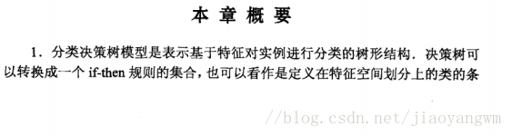
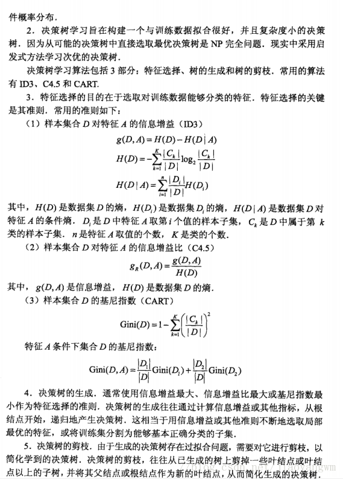

### 1. ID3算法
ID3算法的核心是在决策树各个结点上对应信息增益准则选择特征，递归地构建决策树。

具体方法是：

1）从根结点(root node)开始，对结点计算所有可能的特征的信息增益，选择信息增益最大的特征作为结点的特征。

2）由该特征的不同取值建立子节点，再对子结点递归地调用以上方法，构建决策树；直到所有特征的信息增益均很小或没有特征可以选择为止；

3）最后得到一个决策树。

ID3相当于用极大似然法进行概率模型的选择
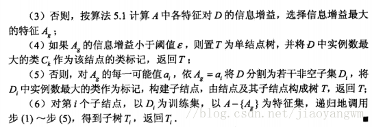

### 2. C4.5的生成算法
与ID3算法相似，但是做了改进，将信息增益比作为选择特征的标准。
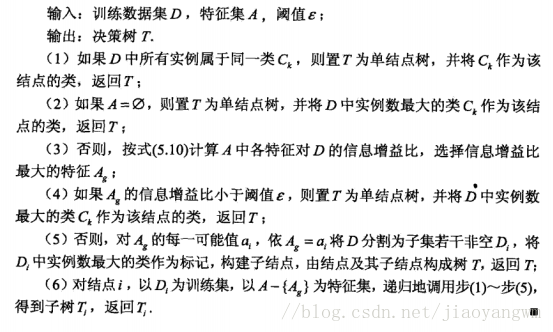

### 3. 递归构建决策树：

从数据集构造决策树算法所需的子功能模块工作原理如下：得到原始数据集，然后基于最好的属性值划分数据集，由于特征值可能多于两个，因此可能存在大于两个分支的数据集划分，第一次划分之后，数据将被向下传递到树分支的下一个节点，在此节点在此划分数据，因此可以使用递归的原则处理数据集。

### 4. 递归结束的条件

程序完全遍历所有划分数据集的属性，或者每个分支下的所有实例都具有相同的分类，如果所有实例具有相同的分类，则得到一个叶子节点或者终止块，任何到达叶子节点的数据必然属于叶子节点的分类

## 2. Dijkstra算法
从物体所在的初始点开始，访问图中的结点。它迭代检查待检查结点集中的结点，并把和该结点最靠近的尚未检查的结点加入待检查结点集。该结点集从初始结点向外扩展，直到到达目标结点。Dijkstra算法保证能找到一条从初始点到目标点的最短路径，只要所有的边都有一个非负的代价值。
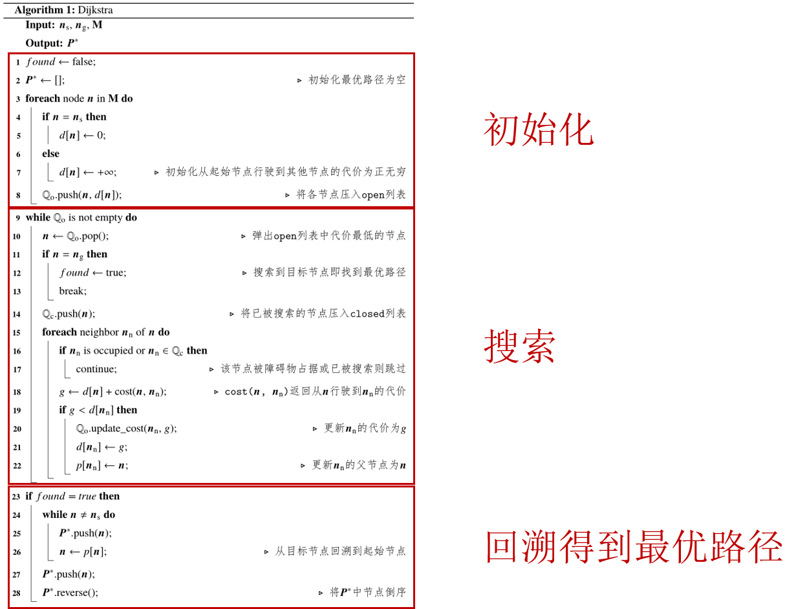

## 3. A*
把Dijkstra算法（靠近初始点的结点）和BFS算法（靠近目标点的结点）的信息块结合起来。在讨论A* 的标准术语中，g(n)表示从初始结点到任意结点n的代价，h(n)表示从结点n到目标点的启发式评估代价（heuristic estimated cost）。在上图中，yellow(h)表示远离目标的结点而teal(g)表示远离初始点的结点。当从初始点向目标点移动时，A*权衡这两者。每次进行主循环时，它检查f(n)最小的结点n，其中f(n) = g(n) + h(n)。
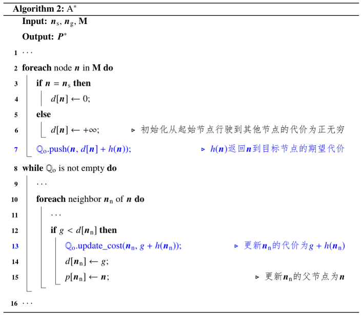

## 4. MDP 马尔可夫过程

## 5. 最优化算法
转：https://blog.csdn.net/Lu_gl/article/details/106983418
### 最优化问题的分类

最优化问题根据变量取值可分为:连续最优化问题(continuous optimizationproblem)和离散最优化问题(discrete optimization problem),而离散最优化问题也称为组合优化问题(combinatorial optimization problem).

#### 连续最优化问题又分为:
线性规划(linear program) (要求目标函数与约束条件均为线性的);

非线性规划(nonlinear program) (目标函数与约束条件未必是线性的).

非线性规划又可分为:
二次规划(quadratic program) (目标函数是二次,约束条件是线性);

凸规划(convex program) (目标函数是凸函数,约束条件是凸集)；

#### 离散最优化问题可分为:
整数规划(integer program);

0-1规划(0-1 program) ;

网络流问题(network flow problem) ;

旅行商问题(traveling salesman problem) .

上述线性规划、非线性规划、整数规划统称为数学规划(mathematical program-ming problem).

- 采用最优化算法解决实际问题主要分为下列两步：

```
1.建立数学模型。对可行方案进行编码（变量），约束条件以及目标函数的构造。
2.最优值的搜索策略。在可行解（约束条件下）搜索最优解的方法，有穷举、随机和启发式搜索方法。
```

### 1. 梯度下降法（Gradient Descent）

梯度下降法是最早最简单，也是最为常用的最优化方法。梯度下降法实现简单，当目标函数是凸函数时，梯度下降法的解是全局解。一般情况下，其解不保证是全局最优解，梯度下降法的速度也未必是最快的。梯度下降法的优化思想是用当前位置负梯度方向作为搜索方向，因为该方向为当前位置的最快下降方向，所以也被称为是”最速下降法“。最速下降法越接近目标值，步长越小，前进越慢。梯度下降法的搜索迭代示意图如下图所示：

<div align = center>

</div>

梯度下降法的缺点：

　　（1）靠近极小值时收敛速度减慢，如下图所示；

　　（2）直线搜索时可能会产生一些问题；

　　（3）可能会“之字形”地下降。


<div align=center> 

</div>

从上图可以看出，梯度下降法在接近最优解的区域收敛速度明显变慢，利用梯度下降法求解需要很多次的迭代。

在机器学习中，基于基本的梯度下降法发展了两种梯度下降方法，分别为`随机梯度下降法`和`批量梯度下降法`。

比如对一个线性回归（Linear Logistics）模型，假设下面的h(x)是要拟合的函数，J(theta)为损失函数，theta是参数，要迭代求解的值，theta求解出来了那最终要拟合的函数h(theta)就出来了。其中m是训练集的样本个数，n是特征的个数。

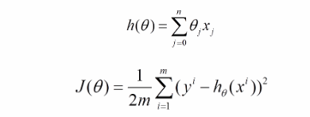

>- 1）批量梯度下降法（Batch Gradient Descent，BGD）

(1) 将J(theta)对theta求偏导，得到每个theta对应的的梯度：
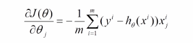

(2）由于是要最小化风险函数，所以按每个参数theta的梯度负方向，来更新每个theta：

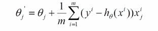

（3）从上面公式可以注意到，它得到的是一个全局最优解，但是每迭代一步，都要用到训练集所有的数据，如果m很大，那么可想而知这种方法的迭代速度会相当的慢。所以，这就引入了另外一种方法——随机梯度下降。

　　对于批量梯度下降法，样本个数m，x为n维向量，一次迭代需要把m个样本全部带入计算，迭代一次计算量为$m*n^2$。

>- 2）随机梯度下降（Stochastic Gradient Descent，SGD）

上面的风险函数可以写成如下这种形式，损失函数对应的是训练集中每个样本的粒度，而上面批量梯度下降对应的是所有的训练样本：

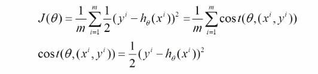

（2）每个样本的损失函数，对theta求偏导得到对应梯度，来更新theta

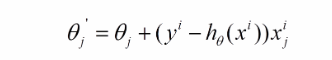

（3）随机梯度下降是通过每个样本来迭代更新一次，如果样本量很大的情况（例如几十万），那么可能只用其中几万条或者几千条的样本，就已经将theta迭代到最优解了，对比上面的批量梯度下降，迭代一次需要用到十几万训练样本，一次迭代不可能最优，如果迭代10次的话就需要遍历训练样本10次。但是，SGD伴随的一个问题是噪音较BGD要多，使得SGD并不是每次迭代都向着整体最优化方向。

随机梯度下降每次迭代只使用一个样本，迭代一次计算量为$n^2$，当样本个数m很大的时候，随机梯度下降迭代一次的速度要远高于批量梯度下降方法。两者的关系可以这样理解：随机梯度下降方法以损失很小的一部分精确度和增加一定数量的迭代次数为代价，换取了总体的优化效率的提升。增加的迭代次数远远小于样本的数量。

**对批量梯度下降法和随机梯度下降法的总结:**

　　**批量梯度下降**---最小化所有训练样本的损失函数，使得最终求解的是全局的最优解，即求解的参数是使得风险函数最小，但是对于大规模样本问题效率低下。

　　**随机梯度下降**---最小化每条样本的损失函数，虽然不是每次迭代得到的损失函数都向着全局最优方向， 但是大的整体的方向是向全局最优解的，最终的结果往往是在全局最优解附近，适用于大规模训练样本情况。

### 2. 牛顿法和拟牛顿法（Newton's method & Quasi-Newton Methods）

>- 1）牛顿法（Newton's method）

牛顿法是一种在实数域和复数域上近似求解方程的方法。方法使用函数f (x)的泰勒级数的前面几项来寻找方程f (x) = 0的根。牛顿法最大的特点就在于它的收敛速度很快。


**具体步骤：**
　　首先，选择一个接近函数 f (x)零点的 x0，计算相应的 f (x0) 和切线斜率f  ' (x0)（这里f ' 表示函数 f  的导数）。然后我们计算穿过点(x0,  f  (x0)) 并且斜率为f '(x0)的直线和 x 轴的交点的x坐标，也就是求如下方程的解：

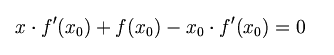

　　我们将新求得的点的 x 坐标命名为x1，通常x1会比x0更接近方程f  (x) = 0的解。因此我们现在可以利用x1开始下一轮迭代。迭代公式可化简为如下所示：

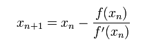

已经证明，如果f  ' 是连续的，并且待求的零点x是孤立的，那么在零点x周围存在一个区域，只要初始值x0位于这个邻近区域内，那么牛顿法必定收敛。 并且，如果f  ' (x)不为0, 那么牛顿法将具有平方收敛的性能. 粗略的说，这意味着每迭代一次，牛顿法结果的有效数字将增加一倍。下图为一个牛顿法执行过程的例子。

由于牛顿法是基于当前位置的切线来确定下一次的位置，所以牛顿法又被很形象地称为是"切线法"。牛顿法的搜索路径（二维情况）如下图所示：

　　牛顿法搜索动态示例图：


关于牛顿法和梯度下降法的效率对比：

从本质上去看，牛顿法是二阶收敛，梯度下降是一阶收敛，所以牛顿法就更快。如果更通俗地说的话，比如你想找一条最短的路径走到一个盆地的最底部，梯度下降法每次只从你当前所处位置选一个坡度最大的方向走一步，牛顿法在选择方向时，不仅会考虑坡度是否够大，还会考虑你走了一步之后，坡度是否会变得更大。所以，可以说牛顿法比梯度下降法看得更远一点，能更快地走到最底部。（牛顿法目光更加长远，所以少走弯路；相对而言，梯度下降法只考虑了局部的最优，没有全局思想。）

根据wiki上的解释，从几何上说，牛顿法就是用一个二次曲面去拟合你当前所处位置的局部曲面，而梯度下降法是用一个平面去拟合当前的局部曲面，通常情况下，二次曲面的拟合会比平面更好，所以牛顿法选择的下降路径会更符合真实的最优下降路径。

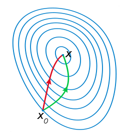

牛顿法的优缺点总结：

　　优点：二阶收敛，收敛速度快；

　　缺点：牛顿法是一种迭代算法，每一步都需要求解目标函数的Hessian矩阵的逆矩阵，计算比较复杂。

参考链接：https://blog.csdn.net/linolzhang/article/details/60151623

>- 2）拟牛顿法（Quasi-Newton Methods）

　　拟牛顿法是求解非线性优化问题最有效的方法之一，于20世纪50年代由美国Argonne国家实验室的物理学家W.C.Davidon所提出来。Davidon设计的这种算法在当时看来是非线性优化领域最具创造性的发明之一。不久R. Fletcher和M. J. D. Powell证实了这种新的算法远比其他方法快速和可靠，使得非线性优化这门学科在一夜之间突飞猛进。

拟牛顿法的本质思想是改善牛顿法每次需要求解复杂的Hessian矩阵的逆矩阵的缺陷，它使用正定矩阵来近似Hessian矩阵的逆，从而简化了运算的复杂度。拟牛顿法和最速下降法一样只要求每一步迭代时知道目标函数的梯度。通过测量梯度的变化，构造一个目标函数的模型使之足以产生超线性收敛性。这类方法大大优于最速下降法，尤其对于困难的问题。另外，因为拟牛顿法不需要二阶导数的信息，所以有时比牛顿法更为有效。如今，优化软件中包含了大量的拟牛顿算法用来解决无约束，约束，和大规模的优化问题。

**具体步骤：**

拟牛顿法的基本思想如下。首先构造目标函数在当前迭代xk的二次模型：

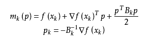

这里Bk是一个对称正定矩阵，于是我们取这个二次模型的最优解作为搜索方向，并且得到新的迭代点：

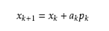

其中我们要求步长ak 满足Wolfe条件。这样的迭代与牛顿法类似，区别就在于用近似的Hesse矩阵Bk  代替真实的Hesse矩阵。所以拟牛顿法最关键的地方就是每一步迭代中矩阵Bk 的更新。现在假设得到一个新的迭代xk+1，并得到一个新的二次模型：

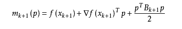

　　我们尽可能地利用上一步的信息来选取Bk。具体地，我们要求
 
 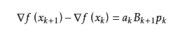

　　从而得到

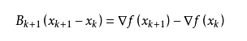

　　这个公式被称为割线方程。常用的拟牛顿法有DFP算法和BFGS算法。

参考：https://blog.csdn.net/songbinxu/article/details/79677948

牛顿法的搜索方向是

$d^{(t)}=-H_t^{-1}g_t$

为了不算二阶导及其逆矩阵，设法构造一个矩阵 U，用它来逼近 H−1
现在为了方便推导，假设 f(x) 是二次函数，于是 Hesse 矩阵 H 是常数阵，任意两点 x(t) 和 x(t+1) 处的梯度之差是：

$\bigtriangledown f(x^{(t+1)}) - \bigtriangledown f(x^{(t)}) =  H\cdot (x^{(t+1)}-x^{(t)})$

等价于

$x^{(t+1)}-x^{(t)} =  H^{-1}\cdot [\bigtriangledown f(x^{(t+1)}) - \bigtriangledown f(x^{(t)})]$

那么对非二次型的情况，也仿照这种形式，要求近似矩阵 U 满足类似的关系：

$x^{(t+1)}-x^{(t)}=U_{t+1}\cdot [\bigtriangledown f(x^{(t+1)})-\bigtriangledown f(x^{(t)})]$

或者写成

$\Delta x_t=U_{t+1}\cdot \Delta g_t$

以上就是拟牛顿条件，不同的拟牛顿法，区别就在于如何确定 U。


### 3. 共轭梯度法（Conjugate Gradient）

　　共轭梯度法是介于最速下降法与牛顿法之间的一个方法，它仅需利用一阶导数信息，但克服了最速下降法收敛慢的缺点，又避免了牛顿法需要存储和计算Hesse矩阵并求逆的缺点，共轭梯度法不仅是解决大型线性方程组最有用的方法之一，也是解大型非线性最优化最有效的算法之一。 在各种优化算法中，共轭梯度法是非常重要的一种。其优点是所需存储量小，具有步收敛性，稳定性高，而且不需要任何外来参数。

下图为共轭梯度法和梯度下降法搜索最优解的路径对比示意图：

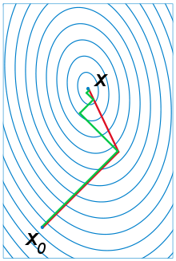


### 4. 凸优化问题,凸二次规划问题QP,凸函数

**约束优化问题**
$$min_{ \ w}  \ \ f(w)$$
$$s.t. \ \ \  g_i(w) \leq 0  \ \ \ \   (i = 1, ... , k)   \ \ \ \ \ \ \ \ \  (1)$$
$$\ \ \ \ \ \ \ \  h_j(w) = 0  \ \ \ \   (j = 1, ... , l)   \ \ \ \ \ \ \ \ \  (2)$$

注：
- 这是一个最小化问题.
- 不等式约束严格执行的含义是“小于等于号”变成“小于号”。

对实数集上的函数，可通过求解二阶导数来判别：
- 若二阶导数在区间上非负，则称为凸函数
- 若二阶导数在区间上恒大于0，则称严格凸函数

仿射函数也是凸函数，只是不是严格凸函数。

凸优化问题是特殊的约束最优化问题。其一般形式形式和约束最优化问题一样。

假设f、g、h在定义域内是连续可微的，且**目标函数f和不等式约束函数g是凸函数**，等式约束h是仿射函数（线性函数），则这种约束最优化问题称为凸优化问题。
因此凸优化问题特征的重要特征：

- 目标函数f，不等式约束函数g是个凸函数
- 等式约束h是仿射函数
- 满足约束最优化问题的一般形式

**凸二次规划问题**
凸二次规划问题是凸优化问题的一个特殊形式，当目标函数是二次型函数且约束函数 g 是仿射函数时，就变成一个凸二次规划问题。凸二次规划问题的一般形式为:
$$\begin{matrix}
\min_{x}  &\frac{1}{2}x^TQx+c^Tx\\ 
  s.t.&Wx \leqslant b 
\end{matrix}$$

- 若 Q 为**半正定矩阵**，则上面的目标函数是凸函数，相应的二次规划为凸二次规划问题；此时若约束条件定义的可行域不为空，且目标函数在此可行域有下界，则该问题有全局最小值。
- 若Q为正定矩阵，则该问题有唯一的全局最小值。例如，最简单的正定矩阵就是单位矩阵。

凸二次规划问题的特征：

- 目标函数f是二次型函数函数
- 等式约束h是仿射函数
- 等式约g是仿射函数
- 满足约束最优化问题的一般形式
  
常用的二次规划问题求解方法有：
- 拉格朗日乘数法：https://www.cnblogs.com/crackpotisback/p/6588947.html
- 内点法:构造具有倒数和对数形式的罚函数，可在可行域内逐步逼向最优点。

### 5. 二次型最优控制QP的介绍：
