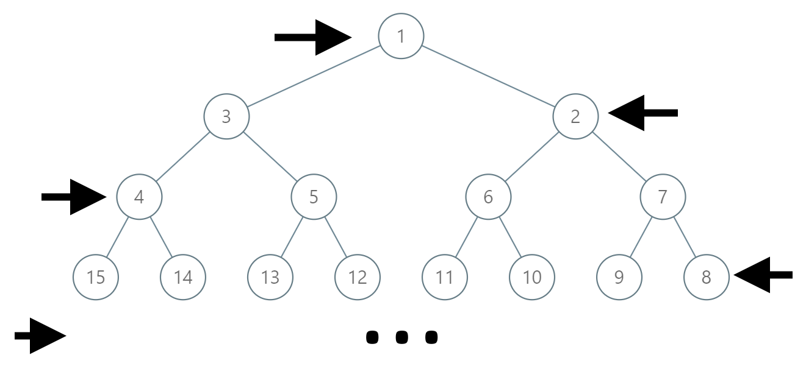

<!-- TOC -->

- [动态数组的初始化](#%E5%8A%A8%E6%80%81%E6%95%B0%E7%BB%84%E7%9A%84%E5%88%9D%E5%A7%8B%E5%8C%96)
- [less great](#less-great)
- [Priority_queue大小顶堆](#priority_queue%E5%A4%A7%E5%B0%8F%E9%A1%B6%E5%A0%86)
- [字符串相关操作](#%E5%AD%97%E7%AC%A6%E4%B8%B2%E7%9B%B8%E5%85%B3%E6%93%8D%E4%BD%9C)
- [find函数](#find%E5%87%BD%E6%95%B0)
- [Sort排序](#sort%E6%8E%92%E5%BA%8F)
- [常用最值](#%E5%B8%B8%E7%94%A8%E6%9C%80%E5%80%BC)
- [二叉树寻路](#%E4%BA%8C%E5%8F%89%E6%A0%91%E5%AF%BB%E8%B7%AF)
- [BFS & DFS](#bfs--dfs)

<!-- /TOC -->

#### 1 动态数组的初始化
对于使用变量进行初始化的应用，例如a=1，b=2，int c[a][b]，编译器会报错，网上查的应该是c++17以上才支持。所以只能使用vector，其初始化如下。

```
一维数组：vector<int> dp=vector<int>(n,0);   //0为数组初值
二维数组：vector<vector<int> > dp=vector<vector<int>> (n,vector<int>(n,1)); //1为数组初值
```

#### 2 less great 
`less <TemplateT>/greater<Template T>`
来自标准库`<functional>`
```
less<Template T>(T &a, T &b) 返a<b
greater<Template T>(T &a, T &b) 返a>b
```
#### 3 Priority_queue大小顶堆
来自标准库 `<queue>`
大顶堆：
`priority_queue<int, vector<int>, less<int> > great_top;`
小顶堆：
`priority_queue<int, vector<int>, greater<int> > less_top;`
其他操作同堆栈。

#### 4 字符串相关操作
数字转字符串：`string str = to_string(num)`
字符串转数字：
```
int int_num = stoi(num); float float_num = stof(num); double double_num = stod(num);
截取字符串：string str = str.sub(n,len) 
//n是第一个字符位置，len是子字符串总长
```

#### 5 find函数
对于`vector：find(res.begin(),res.end(),str)`，若找到返回对应迭代器，未找到返回`res.end()`。
常通过`if(find(res.begin(),res.end(),str)==res.end())`判断是否存在某个子元素。

#### 6 Sort排序
来自标准库`<algorithm>`
```
数组用sort：
int a[10];
sort(a,a+10);

向量用sort：
vector<int> numbers；
sort(numbers.begin(),numbers.end());
```

Sort默认升序排列，想用降序的话需要给cmp函数。
其中cmp定义为
```
static bool cmp(int a, int b)
{
return a<b;
}
```
这里务必在return里不要把a和b顺序搞乱，此时<即为升序，>即为降序。

#### 7 常用最值
来自头文件`<limits.h>`
INT_MAX最大正int值
INT_MIN最小负int值
FLT_MAX/DBL_MAX最大正float/double值
FLT_MIN/DBL_MIN最小正float/double值
若要取最小负值用-FLT_MAX/-DBL_MAX

#### 8 二叉树寻路


```class Solution:
    def pathInZigZagTree(self, label: int) -> List[int]:
        res = list()
        while 1:
            res.append(label)
            if label == 1:
                break
            label >>= 1
            label = label ^ ((1 << (label.bit_length() - 1)) - 1)
        return res[::-1]
```

#### 9 BFS & DFS

dfs(深度优先搜索)是两个搜索中先理解并使用的，其实就是暴力把所有的路径都搜索出来，它运用了回溯，保存这次的位置，深入搜索，都搜索完了便回溯回来，搜下一个位置，直到把所有最深位置都搜一遍，要注意的一点是，搜索的时候有记录走过的位置，标记完后可能要改回来；

bfs(宽度/广度优先搜索)，这个一直理解了思想，不会用，后面才会的，思想，从某点开始，走四面可以走的路，然后在从这些路，在找可以走的路，直到最先找到符合条件的，这个运用需要用到队列(queue)，需要稍微掌握这个才能用bfs。

create a new branch 'new1'

create  'new1'
----------------

sdfh
