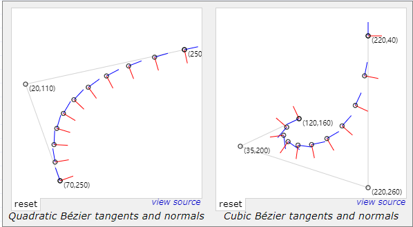
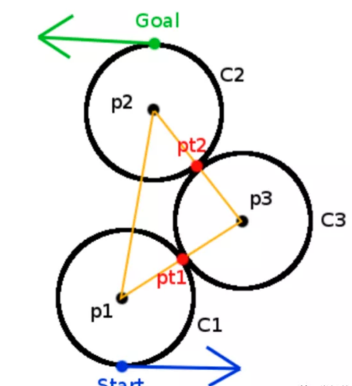

<!-- TOC -->

- [贝塞尔曲线](#%E8%B4%9D%E5%A1%9E%E5%B0%94%E6%9B%B2%E7%BA%BF)
    - [有理贝塞尔曲线](#%E6%9C%89%E7%90%86%E8%B4%9D%E5%A1%9E%E5%B0%94%E6%9B%B2%E7%BA%BF)
    - [贝塞尔曲线导数](#%E8%B4%9D%E5%A1%9E%E5%B0%94%E6%9B%B2%E7%BA%BF%E5%AF%BC%E6%95%B0)
    - [切线和法线](#%E5%88%87%E7%BA%BF%E5%92%8C%E6%B3%95%E7%BA%BF)
- [B样条曲线（B_spline）](#b%E6%A0%B7%E6%9D%A1%E6%9B%B2%E7%BA%BFb_spline)
    - [相关概念](#%E7%9B%B8%E5%85%B3%E6%A6%82%E5%BF%B5)
    - [样条曲线公式](#%E6%A0%B7%E6%9D%A1%E6%9B%B2%E7%BA%BF%E5%85%AC%E5%BC%8F)
    - [均匀B样条曲线](#%E5%9D%87%E5%8C%80b%E6%A0%B7%E6%9D%A1%E6%9B%B2%E7%BA%BF)
    - [准均匀B样条曲线](#%E5%87%86%E5%9D%87%E5%8C%80b%E6%A0%B7%E6%9D%A1%E6%9B%B2%E7%BA%BF)
- [自动驾驶运动规划-Dubins曲线](#%E8%87%AA%E5%8A%A8%E9%A9%BE%E9%A9%B6%E8%BF%90%E5%8A%A8%E8%A7%84%E5%88%92-dubins%E6%9B%B2%E7%BA%BF)
    - [车辆简易模型 Simple Car模型](#%E8%BD%A6%E8%BE%86%E7%AE%80%E6%98%93%E6%A8%A1%E5%9E%8B-simple-car%E6%A8%A1%E5%9E%8B)
    - [Dubins曲线](#dubins%E6%9B%B2%E7%BA%BF)
    - [Dubins计算过程推导](#dubins%E8%AE%A1%E7%AE%97%E8%BF%87%E7%A8%8B%E6%8E%A8%E5%AF%BC)
        - [基于向量的切点计算](#%E5%9F%BA%E4%BA%8E%E5%90%91%E9%87%8F%E7%9A%84%E5%88%87%E7%82%B9%E8%AE%A1%E7%AE%97)
        - [计算CSC类型的行驶曲线](#%E8%AE%A1%E7%AE%97csc%E7%B1%BB%E5%9E%8B%E7%9A%84%E8%A1%8C%E9%A9%B6%E6%9B%B2%E7%BA%BF)
        - [计算CCC类型的行驶曲线](#%E8%AE%A1%E7%AE%97ccc%E7%B1%BB%E5%9E%8B%E7%9A%84%E8%A1%8C%E9%A9%B6%E6%9B%B2%E7%BA%BF)
- [自动驾驶算法](#%E8%87%AA%E5%8A%A8%E9%A9%BE%E9%A9%B6%E7%AE%97%E6%B3%95)

<!-- /TOC -->

### 贝塞尔曲线
参考连接：A Primer on Bézier Curves (https://pomax.github.io/bezierinfo/#matrix)

#### 有理贝塞尔曲线

#### 贝塞尔曲线导数

对控制点进行处理

#### 切线和法线

### B样条曲线（B_spline）
B-样条是贝塞尔曲线(Bézier curve)的一种一般化，B样条不能表示一些基本的曲线，比如圆，所以引入了NURBS，可以进一步推广为非均匀有理B-样条(NURBS)

#### 相关概念
- 节点（knot）
样条曲线（蓝色曲线）映射到定义域（底部黑线）内，在定义域内的点称为节点，定义域范围并不固定，一般使用[0,1]
- 节点点（knot point）
为节点在曲线上的对应点，图上黄色点
- 节点矢量（knot vector）

对应的节点矢量：$[0, \frac{1}{7}, \frac{2}{7}, \frac{3}{7}, \frac{4}{7}, \frac{5}{7}, \frac{6}{7}, 1]$
节点向量$U={u_0, \cdots , u_m}$ 为一个非递减数的集合，将定义域划分为几个区间，当节点在不同区间，采用不同计算，需要满足m=n+k+1（n为控制点数量，k为次数）
- 系数（spline coefficients

每个系数对应一个控制点$P_i={p_0, \cdots , p_n}$，控制点为输入路径点，程序根据控制点拟合样条曲线
- 基函数的次数（B-spline order）
样条基函数的次数$k$

#### 样条曲线公式

$p_u$为曲线点，$u$为节点域内的细分，$d_i$为控制点，$N_{i,k}(u)$为基函数。
$$p_{u} = \sum_{i = 0}^{n}d_iN_{i,k}(u)$$
B样条的基函数通常采用Cox-deBoor递推公式

#### 均匀B样条曲线

* 注意：均匀B样条曲线一般来说无法通过起始点和终点，在生成曲线时，需要调整生成曲线的区间（小于[0,1]），否则生成的曲线有部分无法使用，一般不太建议采用均匀B样条曲线
  

#### 准均匀B样条曲线
节点矢量中两端节点具有重复度k+1，内节点均匀分布重复度为1。

### 自动驾驶运动规划-Dubins曲线
参考链接：http://www.banbeichadexiaojiubei.com/index.php/2020/03/15/%E8%87%AA%E5%8A%A8%E9%A9%BE%E9%A9%B6%E8%BF%90%E5%8A%A8%E8%A7%84%E5%88%92-dubins%E6%9B%B2%E7%BA%BF/

#### 车辆简易模型 Simple Car模型

Simple Car模型将车辆看做平面上的刚体运动，刚体的原点位于车辆后轮的中心；x轴沿着车辆主轴方向，与车辆运动方向相同；车辆在任意一个时刻的姿态可以表述为(x, y, )。车辆的运动速度为s；方向盘的转角为，它与前轮的转角相同；前轮和后轮中心的距离为L；如果方向角的转角固定，车辆会在原地转圈，转圈的半径为。

在一个很短的时间$\Delta t$内，可以认为车辆沿着后轮指向的方向前进，当$\Delta t$趋于0时，有：
$$tan \theta = dy / dx \tag{1}$$
根据数学定义:
$$dy / dx = \dot{y} / \dot{x} \tag{2}$$
$$tan \theta = sin{\theta} / cos{\theta} \tag{3}$$
将2) 和3)代入1)中，得到：
$$-\dot{x}sin{\theta} + \dot{y}cos{\theta} = 0 \tag{5}$$
显然，和是5)式的一个解，两侧乘以速度s等式仍然满足。因此有:
$$\dot{x} = s cos{\theta} \tag{6}$$
$$\dot{y} = s sin{\theta} \tag{7}$$
用$\omega$表示车辆前进的距离，则有：
$$d \omega = \rho d \theta \tag{8}$$
根据三角几何，有:
$$\rho = L / tan{\phi} \tag{9}$$
将9)式代入8)式，得到：
$$d {\theta} = \frac{tan{\phi}}{L} d {\omega} \tag{10}$$
8)式两侧同除以dt， 并根据$\dot{\omega} = s$，得到
$$\dot{\theta} = \frac{s}{L} tan{\phi} \tag{11}$$
至此得到了车辆的运动模型(Motion Model)。

然后引入Action变量，假设车辆运动速度s和方向盘转角$\phi$由Action变量$u_s$和$u_\phi$指定，得到：
$$\dot{x} = u_s cos{\theta} \\
\dot{y} = u_s sin{\theta} \\
\dot{\theta} = \frac{u_s}{L} tan{\phi}
$$

#### Dubins曲线

假设车辆按照常量速度运行:$\mu_s=1$ ，最大转向角度为$\phi_{max}$，最小转弯半径$\rho_{min}$，起点为$q_I$， 终点为$q_G$，我们目标是求解从起点到终点的最短行驶距离。求解最短距离的过程就是优化如下Cost的过程。
$$L(\widetilde{q}, \widetilde{u}) = \int^{t_F}_{0} \sqrt{\dot{x}^2(t) + \dot{y}^2(t)} dt \tag{12}$$
$t_F$是到达$q_G$所需的时间，$q=(x, y, \theta)$，当$q_G$不可达时，$L(\widetilde{q}, \widetilde{u}) = \infty$
由于速度$u_s$是恒定的，根据前面提到的车辆的运动模型:
$$\dot{x} = u_s cos{\theta} \tag{13}$$
$$\dot{y} = u_s sin{\theta} \tag{14}$$
$$\dot{\theta} = \frac{u_s}{L} tan{\phi}$$
其中：$u \in [-tan{\phi_{max}}, tan{\phi_{max}}]$。将13)和14)代入12)，可看到，最短行驶距离只与时间$t_F$有关
令S为车辆直行的Motion Primitive，L和R分别为车辆左转和右转的Motion Primitive，可以证明，任意起点到终点的Dubins最短路径可以由不超过三个Motion Primitives构成。由三个Motion Primitives构成的序列称为一个Word。由于两个连续的、相同的Motion Primitive可以合并为一个Motion Primitive，因此所有可能的Word有10中组合，Dubins证明最优的Word组合只能是如下6个组合之一：
$${L_{\alpha}R_{\beta}L_{\gamma}, R_{\alpha}L_{\beta}R_{\gamma}, L_{\alpha}S_dL_{\gamma}, L_{\alpha}S_dR_{\gamma}, R_{\alpha}S_dL_{\gamma}, R_{\alpha}S_dR_{\gamma}}$$

其中，$\alpha, \gamma \in [0, 2 \pi)$，$\beta \in (\pi, 2\pi)$，这里注意，$\beta$大于$\pi$，如果小于$\pi$，一定有其它的序列优于该序列。

#### Dubins计算过程推导
##### 基于向量的切点计算
假设两个最小转弯半径构成的Circle为 $C_1$和$C_2$，半径分别为$r_1$和$r_2$，圆心分别为$p_1=(x_1, y_1)$和$p_2=(x_2, y_2)$。

1）首先构造C1和C2的圆心$p_1$到$p_2$的向量$V_1 = (x_2-x_1, y_2-y_1)$。
$$D=\sqrt{(x_2 - x_1)^2 + (y_2 - y_1)^2}$$

2）构造C1和C2的外切线切点构成的向量$V_2 = p_{ot2} - p_{ot1}$。

3）构造垂直于$V_2$的单位法向量n，修改$V_1$的使其平行于$V_2$。
$$V_1 - (r_2 - r_1) \cdot n$$
根据法向量的定义：$V_2 \cdot n = 0$，得到：
$$n \cdot (V_1 - (r_2 - r_1) \cdot n) = 0$$
根据单位向量的定义：$n \cdot n = 1$，代入上式得到：
$$n \cdot V_1 = r_2 - r_1 \tag{16}$$
4) 16）式两侧同除以D，得到：
   $$\frac{V_1}{D} \cdot n = \frac{r_2 - r_1}{D} \tag{17}$$
注意，这里$\frac{V_1}{D}$实际是将向量$V_1$单位化。
根据向量点乘的数学定义：
$$\vec{A} \cdot \vec{B} = |A||B|cos(\theta)$$
因此：
$\frac{r_2 - r_1}{D}$等于向量$V_1$与法向量n的夹角的余弦。为了方便书写，定义一个常量$C= \frac{r_2 - r_1}{D}$。
等式17）中只有n是未知数
5）将向量$V_1$旋转角度C就得到向量n。假设$n=(n_x, n_y)$，根据向量旋转的数学定义：
$$n_x = V_{1x} * C - V_{1y} * \sqrt{1-C^2} \\ 
n_y = V_{1x} * \sqrt{1-C^2} + V_{1y} * C$$

6）计算出n之后，就可以很方便的计算出外切线的切点$p_{ot1}$和$p_{ot2}$。从C1的圆心出发，沿着向量n的方向，距离为$r_1$的位置即为切点$p_{ot1}$，$p_{ot2}$亦然。

##### 计算CSC类型的行驶曲线
RSR、LSL、RSL、LSR是CSC类型的行驶曲线，该类型曲线首先计算两个圆的切点，然后车辆沿着最小转弯半径构成的圆周行驶到第一个圆的切点，然后直行到第二个圆的切点，再沿着最小转弯半径构成的圆周行驶到目的地。下面我们以RSR轨迹为例看看如何计算行驶曲线。

假设起点$s = (x_1, y_1, \theta_1)$和终点$g=(x_2, y_2, \theta_2)$，最小转弯半径为$r_{min}$。然后我们计算起点和终点的圆心。
起点的圆心为:
$p_{c1} = (x_1 + r_{min} * cos(\theta_1 - \pi / 2), y_1 + r_{min} * sin(\theta_1 - \pi / 2))$
终点的圆心为：
$p_{c2} = (x_2 + r_{min} * cos(\theta_2 - \pi / 2), y_2 + r_{min} * sin(\theta_2 - \pi / 2))$

得到起点和终点的圆心之后，可以利用3.1小节的切点计算方法，得到切点$p_{ot1}$和$p_{ot2}$。然后就可以得到车辆的行驶轨迹，该轨迹分为三段：start到$p_{ot1}$的圆周弧；$p_{ot1}$和$p_{ot2}$的直线距离；$p_{ot2}$到Goal的圆周弧。至此我们得到了RSR的行驶曲线。

##### 计算CCC类型的行驶曲线
如下图所示，$C_1$和$C_2$的圆心为$p_1$和$p_2$，$C_3$是与$C_1$和$C_2$相切的圆，圆心为$p_3$。

根据数学关系，可得到
$$|\overline{p_1 p_2}| = D = \sqrt{(x_2 - x_1)^2 + (y_2 - y_1)^2} \\ 
|\overline{p_1 p_3}| = 2 r_{min} \\ 
|\overline{p_2 p_3}| = 2 r_{min}$$
记$\theta$为$p_1 p_2$与$p_1 p_3$的夹角，已知三角形的三个边的长度，根据余弦定理，有：

$$\theta = cos^{-1}(\frac{D}{2 r_{min}}) \tag{18}$$
最终可得到
$$p_3 = (x_1 + 2 r_{min} cos(\theta), y_1 + 2 r_{min} sin(\theta))$$
注意此处为LRL模式时，$\theta$需要加上$atan(V_1)$；为RLR模式时，$\theta$需要减去$atan(V_1)$。
然后计算$p_{t1}$和计算$p_{t2}$就变得很容易。定义向量$V_2=p_3 - p_1$，将向量缩放到$r_{min}$。
$$V_2 = \frac{V_2}{||V_2||} * r_{min}$$
最后可以得到交点$p_{t1} = p_1 + V_2$。按照同样的过程可以计算得到$p_{t2}$。然后就可以得到start到$p_{ot1}$的圆周弧；$p_{ot1}$和$p_{ot2}$的圆周弧；$p_{ot2}$到Goal的圆周弧的三段轨迹组成的行驶曲线。

### 自动驾驶算法
https://blog.csdn.net/gophae/category_9660094.html